# 🏗️ Arquitectura Frontend - Agenda Salón

## 📋 Tabla de Contenidos
- [Visión General](#visión-general)
- [Diagrama de Arquitectura](#diagrama-de-arquitectura)
- [Flujo de Navegación](#flujo-de-navegación)
- [Flujo de Autenticación](#flujo-de-autenticación)
- [Flujo de Reserva](#flujo-de-reserva)
- [Gestión de Estado](#gestión-de-estado)
- [API & Servicios](#api--servicios)

---

## Visión General

Sistema de agendamiento de citas para salones de belleza construido con:

**Stack Tecnológico:**
- ⚛️ React 19 + TypeScript
- 🎨 Tailwind CSS v4
- 🔄 React Query (TanStack Query)
- 📝 React Hook Form + Zod
- 🗂️ Zustand (Estado Global)
- 🛣️ React Router v7
- 📡 Axios

---

## Diagrama de Arquitectura

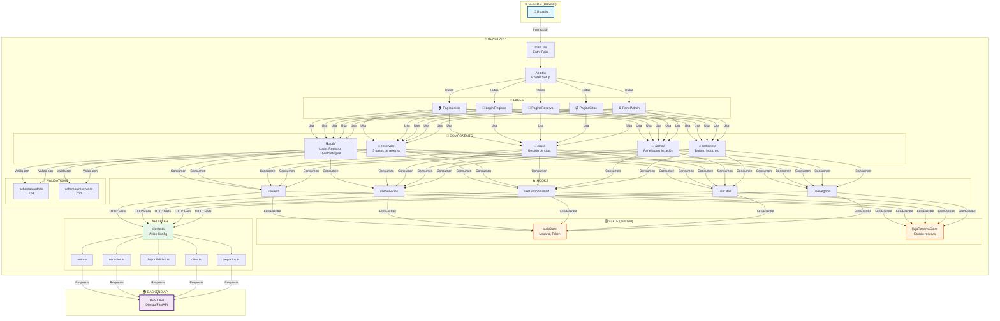

---

## Flujo de Navegación

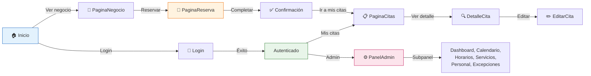

---

## Flujo de Autenticación

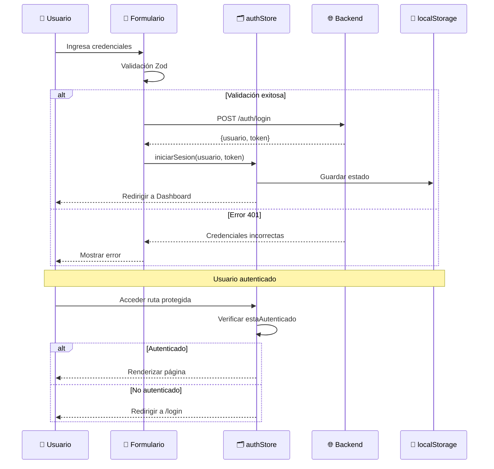

---

## Flujo de Reserva

### Vista General (5 Pasos)

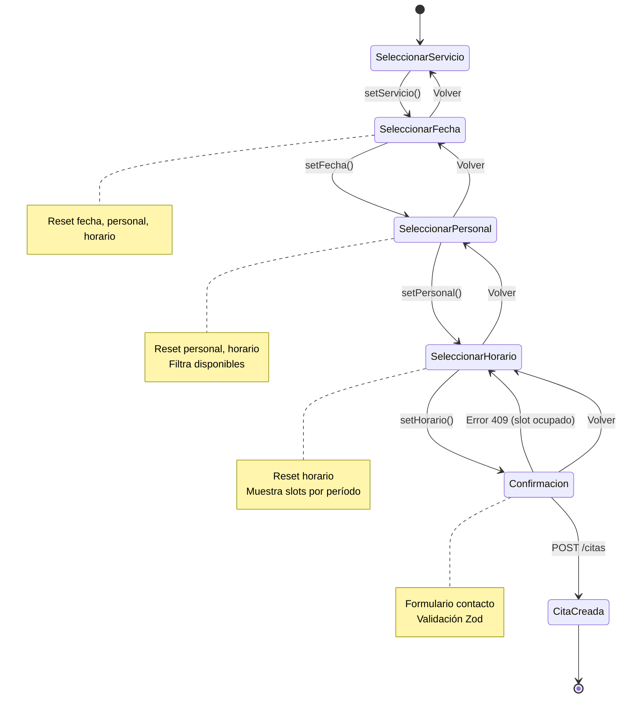

### Flujo Detallado con Estado

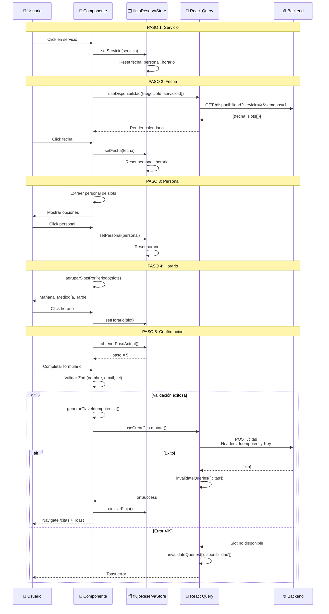

---

## Gestión de Estado

### Zustand Stores

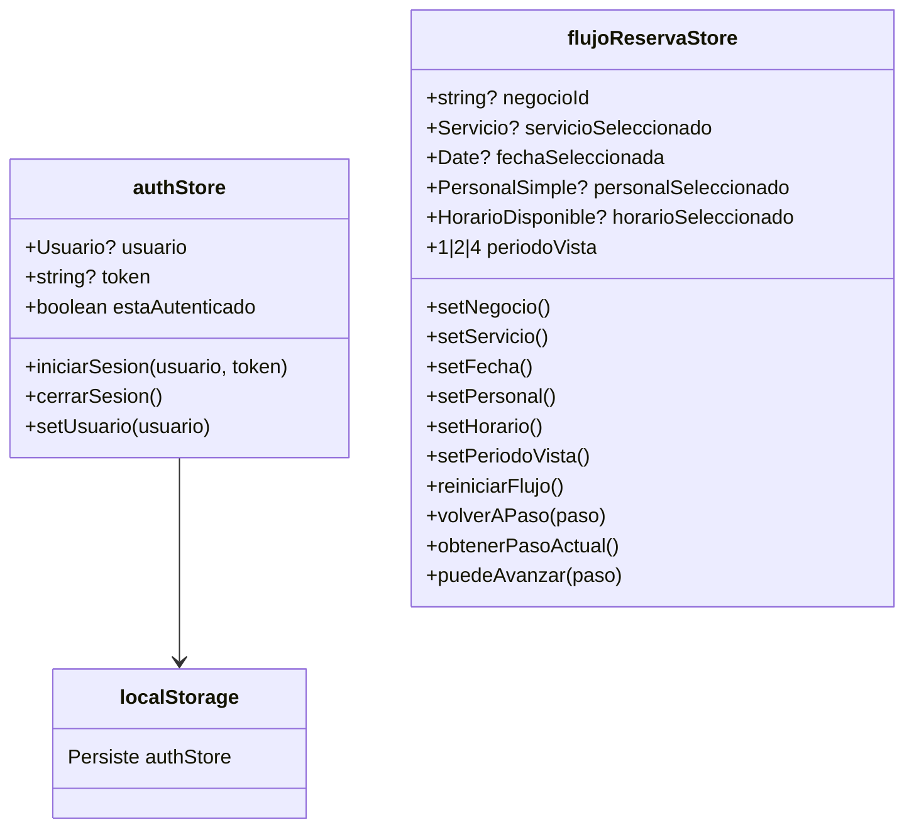

### React Query Cache

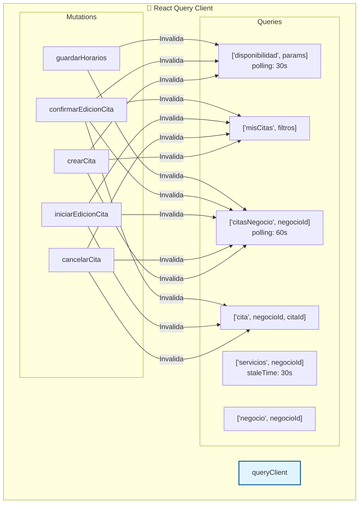

---

## API & Servicios

### Estructura de Servicios

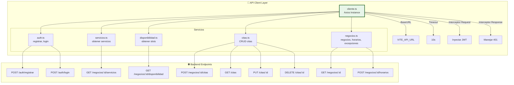

### Transformación de Datos

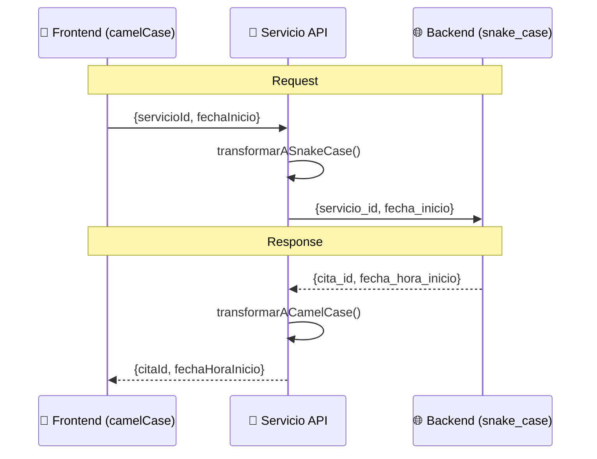

---

## Componentes Principales

### Jerarquía de Componentes

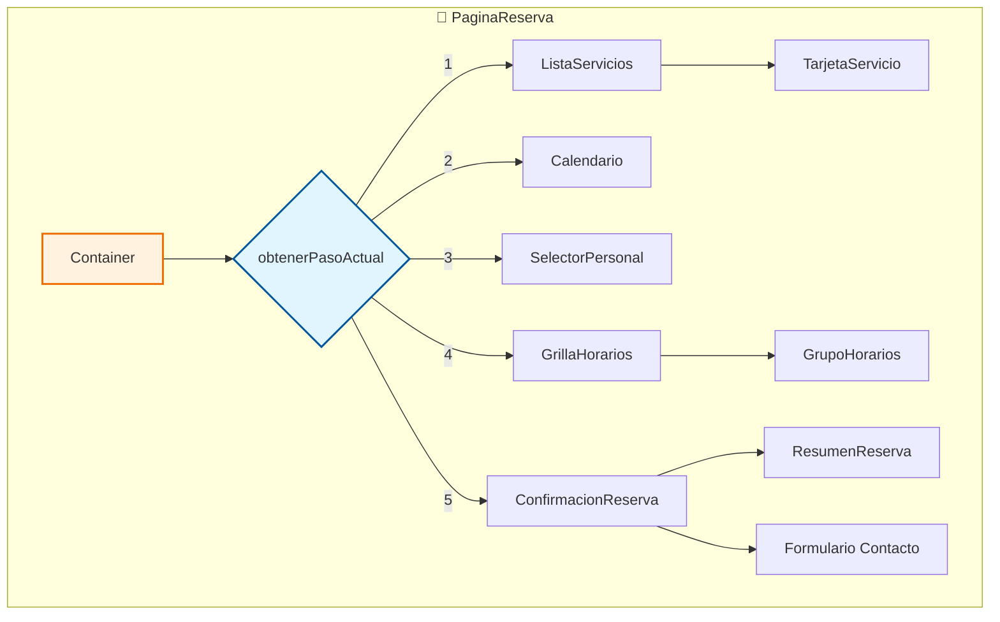

### Componentes Comunes

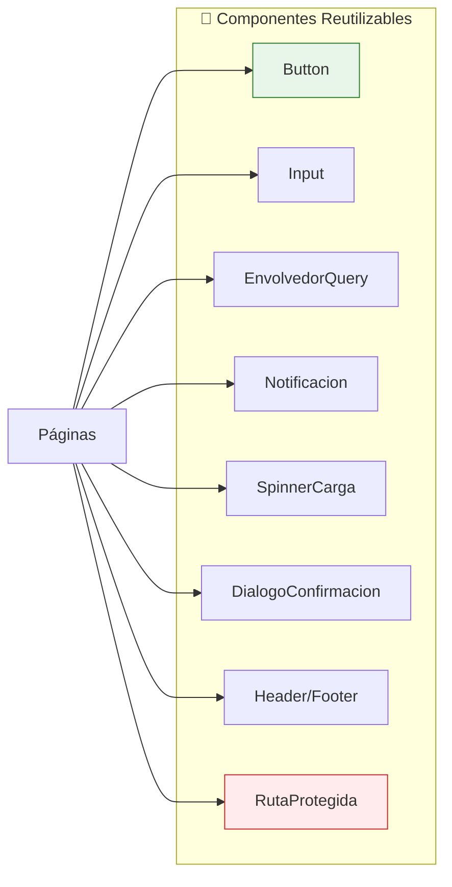

---

## Validaciones y Seguridad

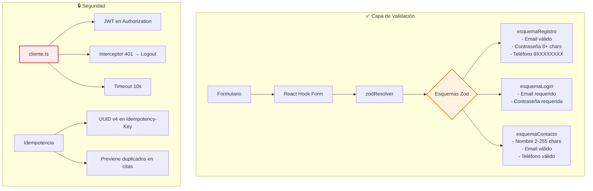

---

## Diagrama de Datos (Tipos)

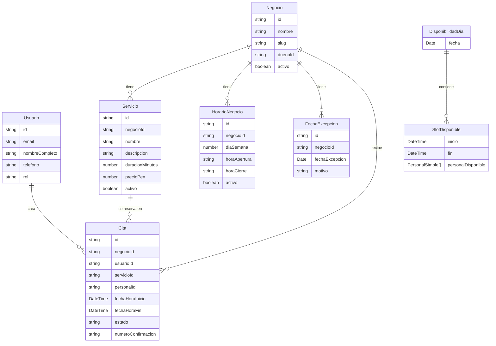

---

## Performance y Optimizaciones

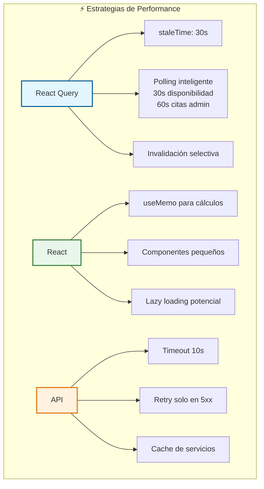

---

## Stack de Tecnologías

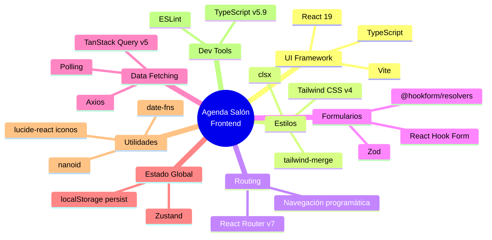

---

## Resumen de Archivos

| Categoría | Archivos | Descripción |
|-----------|----------|-------------|
| **Pages** | 9 | Componentes de página principal |
| **Components** | 40+ | Divididos en auth, citas, reservas, admin, comunes |
| **Hooks** | 22+ | Custom hooks con React Query |
| **Stores** | 2 | authStore, flujoReservaStore |
| **Servicios** | 6 | API clients (auth, citas, servicios, etc) |
| **Schemas** | 2 | Validaciones Zod |
| **Utils** | 3 | Helpers de fecha, idempotencia, Tailwind |
| **Tipos** | 100+ | Interfaces TypeScript |

---

## Próximos Pasos Potenciales

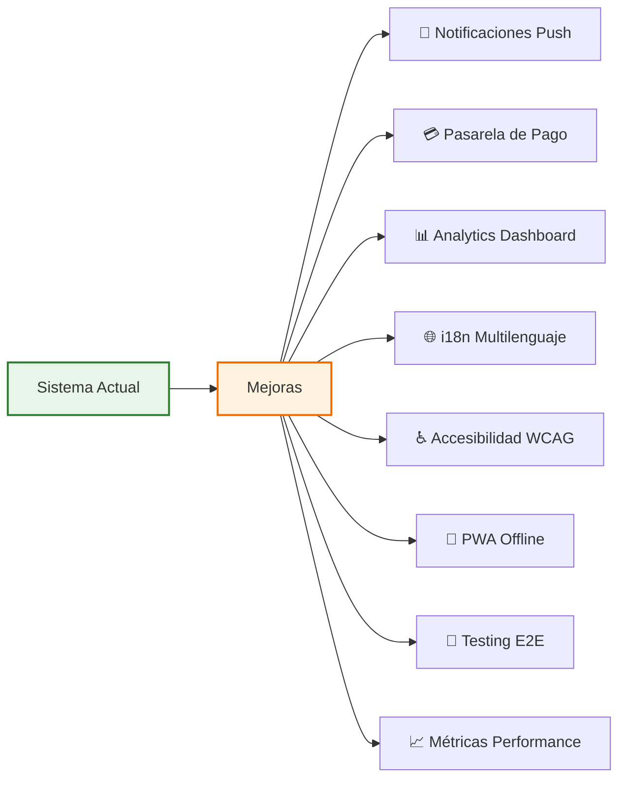

---

## Conclusión

✅ Arquitectura **modular y escalable**
✅ Separación clara de **responsabilidades**
✅ **Performance** optimizado con React Query
✅ **Validaciones** robustas con Zod
✅ **Estado global** bien gestionado
✅ **UX** fluida con loading states y notificaciones
✅ **Idempotencia** en operaciones críticas
✅ **TypeScript** para type-safety

Esta aplicación sigue las **mejores prácticas** de desarrollo moderno con React, asegurando **mantenibilidad**, **escalabilidad** y **excelente experiencia de usuario**.
